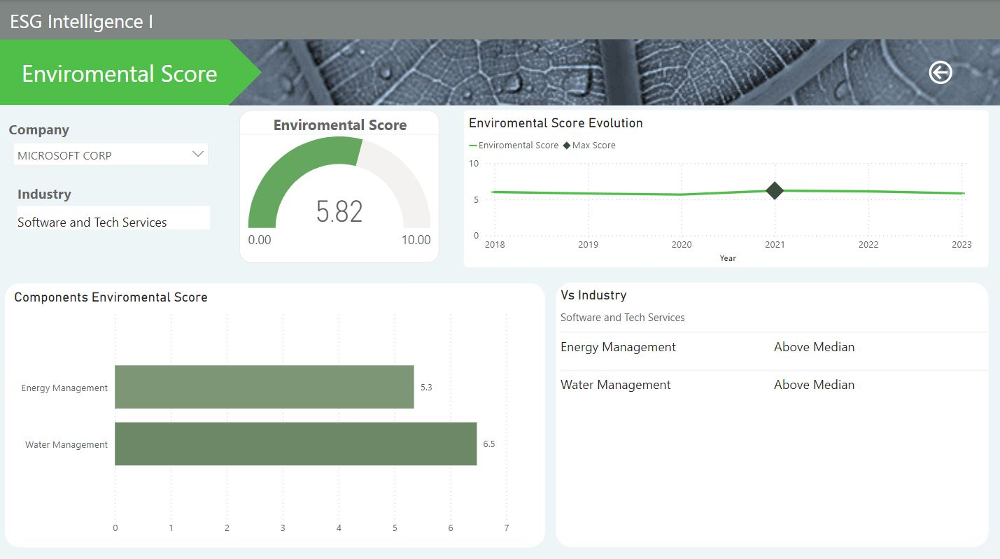

# Final_Project/ ESG Intelligence
# ESG Analysis Tool Project

This project aims to create a tool that allows investors and investment advisors to conduct analysis from an ESG (Environmental, Social, and Governance) perspective, generate an ESG score for each company, and review the evolution of their emissions.

## 1. Definition of Objectives and Scope
- **Main Objective:** Create a tool to analyze and score companies from an ESG perspective and project their emissions evolution to assess their alignment with the Net Zero 2050 goal.
- **Scope:** Includes data collection, ESG analysis, generation of ESG scores, emission predictions, and evaluation of alignment with Net Zero 2050 objectives.

## 2. ESG Definition & Emissions
- **ESG Components:** Environmental, Social, and Governance criteria used by investors to assess the sustainability and ethical impact of investments in a company or asset.
  1. **Environmental (E):** Evaluates how a company impacts and manages natural resources including:
     - Energy and water use
     - Carbon emissions and other pollutants
     - Waste management and recycling
     - Sustainability initiatives and biodiversity protection
  2. **Social (S):** Examines how a company manages relationships with employees, suppliers, customers, and communities, covering:
     - Labor conditions and worker rights
     - Workplace diversity and inclusion
     - Community impact
     - Product responsibility and customer satisfaction
  3. **Governance (G):** Considers how a company is managed and governed, focusing on:
     - Board structure
     - Transparency and disclosure practices
     - Ethical behavior and legal compliance
     - Anti-corruption and anti-bribery policies

- **GHG Emissions:** Classified into three categories to help companies measure and manage their carbon footprint:
  1. **Scope 1: Direct Emissions**
     - **Description:** GHG emissions from sources owned or controlled by the company.
     - **Examples:** Emissions from company fleet vehicles, boilers, furnaces, and any on-site fuel combustion.
  2. **Scope 2: Indirect Energy Emissions**
     - **Description:** GHG emissions from the generation of purchased electricity, heat, or steam consumed by the company.
     - **Examples:** Emissions from power plants generating the electricity used by the company.
  3. **Scope 3: Other Indirect Emissions**
     - **Description:** GHG emissions resulting from company activities but occurring from sources not owned or directly controlled by the company. These are often the most challenging to measure and manage but can be the most significant.
     - **Examples:** Supply chain emissions (production of raw materials, product transport), business travel, use of sold products, waste treatment from operations, and emissions from capital goods.

- **Net Zero 2050:** A global goal adopted by many countries and companies to balance GHG emissions emitted and removed from the atmosphere by 2050. This goal is crucial for limiting global warming to 1.5°C above pre-industrial levels, according to the Paris Agreement.
  - **Key Components:**
    1. **Emission Reduction:** Drastically reduce GHG emissions in all areas (Scope 1, 2, and 3) through clean technologies, energy efficiency, renewable energy, and other sustainable strategies.
    2. **Emission Removal:** Capture and store carbon (CCS), reforestation, and other carbon removal technologies to absorb existing CO2 from the atmosphere.
    3. **Offsets:** Invest in carbon offset projects where reduction and removal are insufficient, such as forest protection, renewable energy, or clean technology development worldwide.
    4. **Innovation and Technology:** Develop and adopt new technologies to enable faster and more effective transitions to carbon neutrality.
    5. **Policies and Regulation:** Implement government policies and regulations promoting and sometimes requiring GHG emission reductions.

## 3. Solutions
1. **Risk Reduction:** Companies meeting ESG criteria are better positioned to face regulations and market changes, reducing long-term financial risks.
2. **Growth Opportunities:** Companies with strong ESG practices can capitalize on new market opportunities such as increasing demand for sustainable products.
3. **Reputation:** Companies excelling in ESG typically enjoy a better reputation, leading to increased customer loyalty and community relations.
4. **Long-term Profitability:** Investments in companies with high ESG scores tend to be more sustainable and potentially more profitable in the long run.

## 4. Data Model Analysis
1. **Data Source:**
   - **Bloomberg API, generating various CSVs:**
     - companies
     - dataset
     - fields
     - hist_score
     - hist_scope
   - **Custom Materiality Map:** With weightings and variable usage based on industry.
2. **Python Transformation:**
   - Data cleaning and generation of new metrics and relationships creating new tables:
     - merged_data
     - filtered_merged_data
     - ESG_score
     - esg_percentage
     - environmental
     - social
     - governance
     - materiality
     - historical_score
     - historical_scope
   - **Machine Learning (Prophet):** Creating emission projections for upcoming years:
     - projections
3. **SQLite3 Database:**
   - Storing CSV-generated tables into a database.
4. **Power BI:**
   - Connecting Power BI to the database, generating a star schema model:
     - merged_data: Fact table with ISIN key, company-specific data, and industry.
     - filtered_merged_data: Combined metrics and data from other tables.
     - ESG: Consolidated table aggregating global ESG scores.
     - esg_percentage: Percentage data of ESG score.
     - environmental, social, governance: Specific data tables for each ESG dimension.
     - historical_scope and historical_score: Historical data on emissions and ESG scores respectively.
     - projections: Future emission projections.
     - Selectable Columns: Table enabling selection of specific columns.

  
  

## 5. Data Architecture
- Diagram illustrating data flow and connections.


## 6. Dashboard




## 7. Next Steps
- Expand industries beyond current coverage (Semiconductors, Automobiles, Software).
- Further delve into potential risks and opportunities.
- Implement portfolio aggregation and scoring capabilities.
- Quantify opportunities and risks for incorporation into company valuations.

This detailed plan sets a strong foundation for developing a comprehensive ESG analysis tool, providing investors and advisors with insights into both financial performance and the broader environmental, social, and governance impacts of their investments.


### :file_folder: **Folder structure**
```

📁 Folder structure

>>>>>>> b70307d61109b0530afa7c7b3e99a1162f3e03ec
└── Final_Project
    ├── .gitignore
    ├── README.md
    ├── ESG Intelligence.pbix
    ├── notebooks
    │   ├── others
    │   ├── EDA_v2.ipynb
    │   ├── Materiality.ipynb
    │   ├── Histrical.ipynb
    │   ├── MachineLearning.ipynb
    │   └── SQLite.ipynb
    │   
    │  data
    │    ├── merged_data
    │    ├── ESG_score
    │    ├── enviromental
    │    ├── social
    │    ├── governance
    │    ├── esg_percentage
    │    ├── filtered_merged_data
    │    ├── materiality
    │    ├── historical_score
    │    ├── historical_scope
    │    └── projections
    │ 
    │  database
    │ 
    └── images

   ``` 


        

